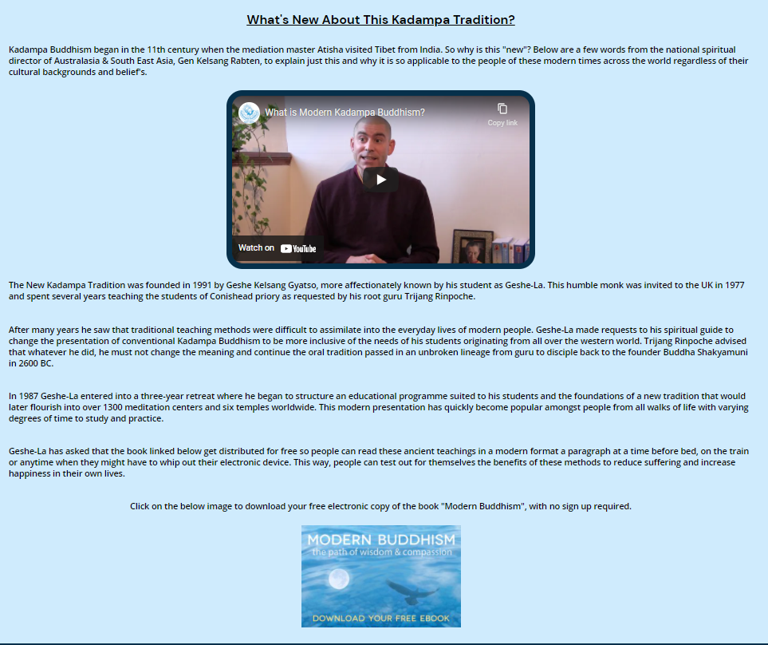
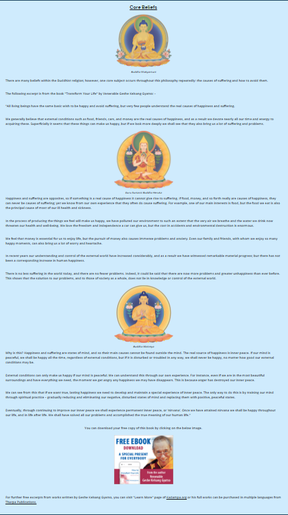
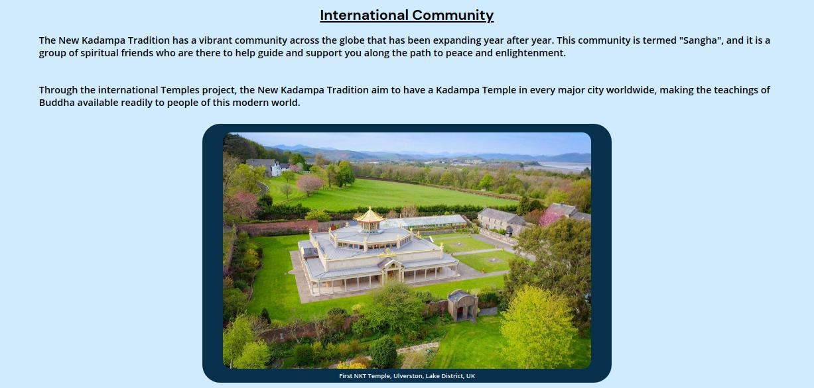
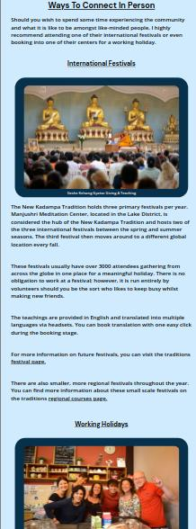
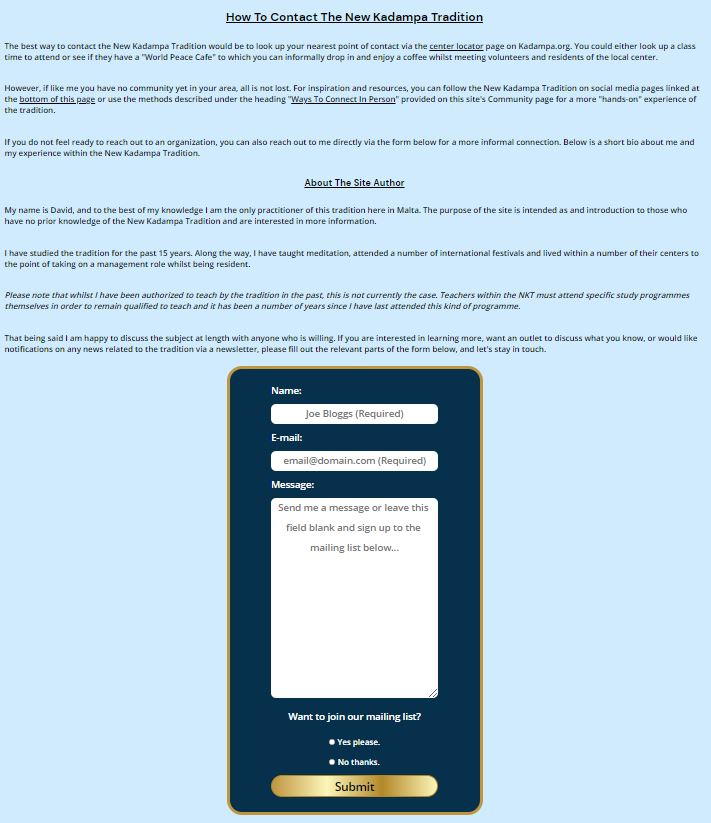

# **Modern Buddhism**
## **Site Overview**
The New Kadampa Tradition (NKT) is a modern form of Buddhism without any cultural influence from the east. It stems from Tibetan Buddhism, which is known publicly in the west; however, the NKT aims to be more accessible to people with a busy lifestyle. It removes a lot of the cultural aspects of the Tibetan nations and provides everything in English.  Typically when someone wishes to learn the teachings from the Tibetan schools, they would be required to learn Tibetan and perform lengthy rituals to gain the full benefit of the practice.  The founder of the NKT, Geshe Kelsang Gyatso saw that cultural influences from Tibet were an obstacle to western practitioners. He worked diligently to create a structure that was best suited to modern life.

## Table of contents:
1. [**Site Overview**](#site-overview)
1. [**Planning stage**](#planning-stage)
    * [***Target Audiences***](#target-audiences)
    * [***User Story's***](#user-storys)
    * [***Site Aims***](#site-aims)
    * [***How Is This Will Be Achieved:***](#how-is-this-will-be-achieved)
    * [***Wireframes***](#wireframes)
    * [***Color Scheme***](#color-scheme)
1. [**Current Features Common to all pages**](#current-features-common-to-all-pages)
    * [***Header Element:***](#header-element)
        * [*Title*](#title)
        * [*Logos*](#logos)
        * [*Navigation Bar*](#navigation-bar)
    * [**Hero Images:**](#hero-images)
      * [***About Page***:](#about-page)
          * [*Hero-Image*](#hero-image)
          * [*Quote*](#quote)
      * [***Teachings page***:](#teachings-page)
          * [*Hero-Image*](#hero-image-1)
          * [*Quote*](#quote-1)
      * [***Community page:***](#community-page)
          * [*Hero-Image*](#hero-image-2)
          * [*Quote*](#quote-2)
      * [***Contact and Form-Feedback pages:***](#contact-and-form-feedback-pages)
          * [*Hero-Image*](#hero-image-3)
          * [*Quote*](#quote-3)
    * [**Anchor Tags Within all Pages Main Content**](#anchor-tags-within-all-pages-main-content)
    * [**Footer**](#footer)
    * [**Typography**](#typography)
1. [**Individual Page Content features**](#individual-page-content-features)
    * [**About Page Content**](#about-page-content)
    * [**Teachings Page Content**](#teachings-page-content)
    * [**Community Page Content**](#community-page-content)
    * [**Contact Page Content**](#contact-page-content)
    * [**Form Feedback Page Content**](#form-feedback-page-content)
1. [**Future-Enhancements**](#future-enhancements)
1. [**Testing Phase**](#testing-phase)
1. [**Deployment**](#deployment)
1. [**Credits**](#credits)
    * [**Honorable mentions**](#honorable-mentions)
    * [**General reference**](#general-reference)
    * [**Content**](#content)
    * [**Media**](#media)

## **Planning stage**
### **Target Audiences:**
* Users craving to be happy yet have failed to find the answers outside in the world outside of themselves. 
* Users with a general interest in Buddhism and want to learn more.
* Users who have never heard of the NKT.
* Users who have heard of the NKT but would like to find more information on the tradition.

### **User Stories:**
* As a user, I want to see the subject matter of the page.
* As a user, I want to navigate the page to find what I require quickly and easily.
* As a user, I want to leave feeling as I know more about the subject when leaving each page than when I arrived at the site.
* As a user, I was to be able to navigate my way to free resources easily.
* As a user, I want to reach out and connect to discuss/experience the subject matter on a deeper level. 

### **Site Aims:**
* To educate the user on the NKT.
* To educate the user on the core value of Buddhism.
* To offer the user a chance to connect to the international community in person.
* Provide the user with the information required to check for a base of operations close to them.
* To offer the user a way to contact the site author for further info or discussion.
* Provide a method by which the user can subscribe to a newsletter.

### **How Is This Will Be Achieved:**
* The home page provides the user with a summary of the tradition, how it is suitable for modern people and how the NKT came to be.

* The site will provide multiple free resources such as 
    * Two free ebooks with an excerpt used on the teaching page to highlight a core concept in Buddhism.
    * Links to further free resources via the NKT's official homepage and their social media pages. 
    * Embedded YouTube videos.

* The site will provide information on the options available to engage with the international community.
    * Working holidays.
    * International festivals.

* The site provides a link to a meditation center locator tool hosted on Kadampa.org. 

* If the user is in a country or region without a nearby center or wishes to speak to someone informally about the subject, I have included a contact form to connect the site author directly. The reason for this also relates to the [Future-enhancements](#future-enhancements) section listed later in this readme. 

* Providing a newsletter to which the user can subscribe while sending the site author a message or by omitting the message and selecting the appropriate option before clicking the submit button.

### **Wireframes:**
To organize my thoughts and prevent scope creep, I created wireframes for this project. Below are links to each of the mobile and desktop versions of the four intended pages. 

* Mobile Wireframes:
    * [Homepage (About)](docs/wireframes/homepage-mobile.png)
    * [Teachings page](docs/wireframes/teaching-mobile.png)
    * [Community page](docs/wireframes/community-mobile.png)
    * [Contact page](docs/wireframes/contact-mobile.png)

* Desktop wireframes:
    * [Homepage (About)](docs/wireframes/homepage-desktop.png)
    * [Teachings page](docs/wireframes/teachings-desktop.png)
    * [Community page](docs/wireframes/community-desktop.png)
    * [Contact page](docs/wireframes/contact-desktop.png)

There was some deviation from the original wireframes to improve the User Experience (UX). Such variations include: -

* The inclusion of a hero image and quote on each page to improve uniformity across all pages.
* I used images on the teaching page to break up the text.
* Headings and content placement to allow for the flow of information to be relevant.
* A second logo was added to the header on larger screens to add symmetry and make the design more appealing to the eye.
* The two boxes in the footer were initially intended to be the images for the ebook downloads used in the final design. I abandoned this idea not to increase the footer height on mobile devices and improve the flow of information as the user progressed through the pages.

### **Color Scheme:**
When deciding the color scheme, I wanted to go with something that gave an elegant appearance. For this reason, I selected a range of blue and gold's and used the following color grid created on [https://contrast-grid.eightshapes.com/](https://contrast-grid.eightshapes.com/?version=1.1.0&background-colors=&foreground-colors=%23fcf6ba%2C%0D%0A%23b38728%2C%0D%0A%23fbf5b7%2C%0D%0A%23bf953f%0D%0A%23000%0D%0A%23FFFFFF%2C%20%0D%0A%2306304b%0D%0A%23cfebfd%0D%0A&es-color-form__tile-size=compact&es-color-form__show-contrast=aaa&es-color-form__show-contrast=aa&es-color-form__show-contrast=aa18&es-color-form__show-contrast=dnp) to check the contrast scores. Using this grid allowed me to ensure all text remained visible and the site was accessible to all.

## **Current Features Common to all pages**
###  **Header Element**
The header element sticks to the top of the page as the user scrolls up and down. Originally I had designed the page with a "return to top" link at the bottom of the page. However, a Code Institute graduate pointed out that the sticky header would provide a more pleasant UX and adhere to popular conventions better. The header itself contains the following features: 

#### *Title:*

* The title serves to state the name of the tradition.
* It also serves as a navigation link to the home page called "about" as per the well-established convention expected by the user.

#### *Logos:*
* The logos illustrate the site's theme and offer something to appease the user's eye by filling the blank space without distracting from the title.

    * One logo on mobile devices ensured the title stays as big as possible on a smaller screen, improving the user experience.

        

    * Two logos on larger screens gave better symmetry to the header while filling the excess white space provided by broader screen sizes.

        

#### *Navigation Bar:*
* The navigation bar appears on all five pages (including the form feedback page). 
* It contains links to the about, teachings, community, and contact page to allow easy navigation around the website. 
* The below image shows the user's current page highlighted in blue with a white border. 
* Hover over feature, which turns the menu option the same as the active page when users hover their cursor over the navbar heading.

***
### **Hero Images**
* I have included a hero image on each page to make the site uniform across all pages. 
* Each image has a zoom animation to grab the attention of the user. 
* Each image has an overlaid quote designed to give the user a brief insight into the teachings of the NKT.

### **About Page**:
#### *Hero-Image:*
The hero image depicts Geshe Kelsang Gyatso, who was the founder of the New Kadampa Tradition. He is smiling and waving as if welcoming the user to the page. Behind him is the NKT's primary temple, which holds great significance. The temple pictured hosts two of the NKT's international festivals and is within the grounds of Manjushri Meditation center, considered the hub of the NKT's global operations.

#### *Quote:*
The quote included on the about page is "We need modern ideas, but we also need ancient wisdom." which perfectly sums up the page's subject matter that begins with what the NKT is.

### **Teachings page**:
#### *Hero-Image:*
This image is Geshe Kelsang Gyatso sat on what is commonly called a throne at one of the traditions international festivals. The throne is where a teacher sits to expound the oral lineage passed from teacher to disciple, and so it was appropriate for a page discussing the core beliefs of the philosophy in his own words.

#### *Quote:*
The quote included on the teachings page is "Happiness and suffering are states of mind and so their main causes are not to be found outside the mind." which compliments the subject matter of the page's content.

### **Community page:**
#### *Hero-Image:*
This image is taken from behind Geshe Kelsang Gyatso, teaching at a festival. The intention is to show the extent of the international community attending one of these events.

#### *Quote:*
The quote on the community page is, "Buddha is the doctor who gives us this medicine, and the Sangha are the nurses who assist us." Sangha is defined in the page's content and shows the importance and function of the community within the NKT.

### **Contact and Form-Feedback pages:**
These two hero images and quotes were kept the same to simulate still being on the same page after the form is submitted.

#### *Hero-Image:*
The artwork pictures three of the common deities used within the New Kadampa Tradition. I used this to be eye-catching even when viewed from smaller devices.

#### *Quote:*
The quote used for these two pages is, "If everyone sincerely practices the path of compassion and wisdom, all their problems will be solved. I guarantee this.". I chose this quote to encourage people to reach out to their local community or learn more about the tradition and their teachings.

## **Anchor Tags Within all Pages Main Content**
* All anchor tags in the page's main content were left with the underline decoration to make it clear to the user that I had embedded a hyperlink.  
* I  changed the color to black to match the surrounding text, meaning the anchor tag did not look out of place or lower the contrast score.
* Have a hover-over effect that turns the Hyperlink a darker color from the gold gradient used throughout the page.
* Have the cursor set to a pointer.  A Pointer is a browser default setting; however, I noted it did not default for buttons. I added the cursor: pointer rule to the styles.css for the form submit button, and I decide to create a separate rule for a:hover just in case the browser provider ever changed the browser default.

## **Footer**
* The footer includes direct links to all the NKT's social media accounts with an invitation to connect to the NKT directly via these channels.

* These icons were imported from font awesome using Javascript at the bottom of the page. I was advised that linking the CDN in the header would load faster however the lighthouse tools in devtools showed a different story as the performance score became negatively affected by the CDN link.

* I included a disclaimer that the site is intended solely for educational purposes and that all images and videos remain the property of NKT-IKBU. I added this after seeking advice from the Code Institute on slack. To make an accurate tribute to the tradition, I needed to use the appropriate images. Most of the pictures found on the usual image source websites were of entirely different Buddhist practice and were irrelevant to my theme.

## **Typography**
* Throughout the page there are three fonts used:
  * Oswald - For the title to give it a strong presence.
  * DM sans - For all other headings including the navbar. 
  * Open sans - for all content text.

* DM and Open sans were both selected to complement each other and because they have a soft appearance which I thought best suited to a site on Buddhism.
* All fonts were sourced from Google fonts as stated in the credits.

## **Individual Page Content features**
### **About Page Content:**

* This page gives a brief historical summary of the New Kadampa tradition, a quick overview of how the NKT came to be.
* The embedded youtube video is of one of the traditions senior teachers giving a summary of what modern Buddhism is to the tradition and why it is so applicable to people of the contemporary world. 
* At the end of the content, there is an anchor tag wrapped around a clickable image so the user can download a free copy of one of Geshe Kelsang Gyatso's books called "Modern Buddhism" in electronic format.

### **Teachings Page Content:**
* Includes an excerpt from the downloadable ebook "Transform Your Life" by Geshe Kelsang Gyatso. 
* Covers the core beliefs behind what Buddhism teaches. 
* I  included images to break up the monotony of the long passage.  
  * The images symbolize the traditions linage and are the decorations used in Geshe Kelsang Gyatso's books between pages. 
  * Images are wrapped in a figure element and given a figcaption to detail who the image portrays. *Note: It was outside the scope of the project's MVP to detail the full linage of the NKT. See [Future-Enhancements](#future-enhancements) for details of how the lineage will later include it if required*
* The last image towards the bottom of the page is wrapped in an anchor tag. The image contains text inviting the user to download a full copy of the book if the user wishes to read further. 
* Link provided for further free excerpts from Geshe Kelsang Gyatso's books via an external site.  
* Link provided to Tharpa publications run by the NKT where the users can purchase the full range of Geshe Kelsang Gyatso books and materials, including Buddhist prays and artwork approved by the tradition. 

### **Community Page Content:**

* Begins by explaining the terminology used in the hero image quote. This explanation then introduces the NKT's international community and their goal to achieve the accessibility of Buddha's teachings to people worldwide.
* This section includes an image of the NKT's first-ever temple.

* The user is presented with two methods to connect directly with the international community and further their experience of Modern Buddhism.

* Smaller screen sizes show the section "Ways To Connect In-Person" as a single column with the articles stacked one above the other and no background to ensure a better user experience.

### **Contact Page Content**

* Reiterates ways to reach out to the New Kadampa Tradition in the user's local area and refers them to the ways to connect section on the community page.
* User is offered a way to contact me as the site author should they wish to discuss the subject matter further. This section includes a short biography about me and my experience in the NKT.
* Form used has three required fields. 
    * The first two are name and email, so I know who has sent the communication and where to respond appropriately. 
    * The third required field is the two radio buttons linked via the attribute value name="mailing_list". The user must select one of these options to click submit and cannot choose both.
* In between these required fields is an optional text area so the user can choose to send me a message.  
* The submit button has a shimmer effect as feedback when the user hovers the pointer over it. 

*Note: This form doesn't function to gather any data; it was created with a GET request to call a feedback page. The submit button then triggers the GET request to load the form feedback page outlined later in the readme. This feature is to simulate a real functional form only.*

### **Form Feedback Page Content**
* I created this page to mimic the effect of actually submitting a form. 
* I centered the text alignment on this page only. For all other pages I set the the text-alignment property to "justify" on smaller screen widths and to "left" on larger screens. I made this decision because of the lack of text on the form feedback page. Matching the alignment to the other pages looked out of place.
* Since filling in the form suggests the user is interested in learning more, I have included a longer feature video about the tradition here. *Note: Originally, I had wanted to use this on the home page, but due to the length of the video, I deemed it too long for an introduction. There is no auto play on the videos, so the user can choose whether they want to engage with the video or not.*
* Link included within the content to take the user back to the initial contact page, in case they wanted to look at the ways to contact a local meditation center, send an additional message, or sign up to the mailing list.

## **Future-Enhancements**

* The future intention of the site would be to serve as a website specifically for Malta, where there is no community until now. However, Due to the summer break, which the tradition undergoes every year, I could not reach the traditions director with my request for permission. I decided to build a tribute site to showcase to the head office and adapt the content to be more Malta specific later on. 

* At first, the purpose would remain to educate and raise awareness meaning the current content would still be applicable; however, There would be additional content I could add as interest grew. Such things would be: -

    * Times/dates/venues for Meetups in Malta to build a community
    * Times/dates/venues for Book clubs to study and discuss the materials and methods to apply them to daily life.
    * More information on the lineage of the tradition to include short biographies.

* Eventually, when Malta was designated a teacher by the head office these would then convert into: -

    * Times/dates/venues/fees for Formal classes
    * Times/dates/venues/fees for Public talks/events
    * Include a bio for Malta's officially designated teacher at the end of the traditions lineage page or add a new page that summarizes their experience.

* Once I better understand Javascript, I would like to add a burger menu for mobile-sized device screens. I found articles on achieving this with CSS and HTML alone; however, I did not deem this necessary to create the minimum viable product which is this project.

* I would also make the contact form fully function with a post request and have a database to collate data for the mailing list.
***
## **Testing Phase**
I have included details of testing both during development and post development in a separate document called [TESTING.md](TESTING.md).
***
## **Deployment**
I deployed the page on GitHub pages via the following procedure: -

1. From the projects [repository](https://github.com/dnlbowers/modern-buddhism), go to the **Settings** tab.
2. From the left-hand menu, select the **Pages** tab.
3. Under the **Source** section, select the **Main** branch from the drop-down menu and click **Save**.
4. A message will be displayed to indicate a successful deployment to GitHub pages and provide the live link.

The live site can be found here - [Modern Buddhism live webpage](https://dnlbowers.github.io/modern-buddhism/index.html)
***
## **Credits**
### **Honorable mentions**
This project could not have happened without the support of the following people listed in no particular order:

* [Mark Cutajar](https://github.com/markcutajar) - He who possesses screens so clear the mouth waters at the mere sight of them. Also a code guru who let me share his office during the initial development stage whilst I was visiting him in Scotland. This man is part of the reason I entered the world of programming.
* [Richard Wells](https://github.com/D0nni387) - Code Institute Mentor who has gone above and beyond what was expected of him to help me get this far in the course.
* [Matt Bodden](https://github.com/MattBCoding) - 24/7 tester, advisor, muse and support. I truly cannot thank him enough, Matt you're a living legend!.  
* [Monica Hrda](https://github.com/monika-hrda) - Style adviser and tester (go study!).
* [Anthony O'Brien](https://github.com/D0nni387) - Tester, advisor, motivator and my introduction to CSS flex and connecting VSCode to Github.
* [Simen Daehlin](https://github.com/Eventyret) - For the longest and most comprehensive peer review that I received via slack. His feedback was truly amazing and although parts of it confused me, it pushed me to become a better developer.  
* The code institute Slack community as a whole who tested and supported throughout.

* And the biggest thanks goes to my wife and child who have had to deal with me face to face through it all. Oliver has been my reason for change and Analise my inspiration. 

### **General reference:**
* The project was influenced by the Code Institutes code along project called Love running. Whilst I have tried to deviate as much as possible there may be some similarities in the code.
* I relied upon W3schools, MDN web docs and stack overflow for general references throughout the project.

### **Content:**
* All Content was written by myself with the exception of the below excerpt on teachings.html
* The excerpt from Transform your life on teachings.html - [kadampa.org](https://kadampa.org/reference/buddhist-beliefs)
* Icons in the footer were taken from [Font Awesome](https://fontawesome.com)
* The golden gradient colour scheme - [brandgradients.com](http://www.brandgradients.com/gold-gradient).
* All fonts imported from - [Google Fonts](https://fonts.google.com/)
* Hero image quotes taken from a range of sources - [About (index) Page Quote](https://www.azquotes.com/quote/864975), [Teachings Page Quote](https://www.goodreads.com/author/quotes/13768667.Kelsang_Gyatso#:~:text=%E2%80%9CHappiness%20and%20suffering%20are%20states,be%20found%20outside%20the%20mind.%E2%80%9D&text=Therefore%2C%20if%20we%20want%20to,we%20must%20transform%20our%20mind.%E2%80%9D), [Community Page Quote](https://kadampa.org/buddhism/refuge), [Contact Page/Form-Feedback Page Quote](https://books.google.at/books?id=rLq0icrylRAC&pg=PA4&lpg=PA4&dq=%22If+Everyone+Sincerely+Practices+The+Path+Of+Compassion+And+Wisdom,+All+Their+Problems+Will+Be+Solved.+I+Guarantee+This&source=bl&ots=cnWI9WrXmy&sig=ACfU3U00afgbFxI8NXS6LrvBonG8Vlh1CQ&hl=en&sa=X&ved=2ahUKEwjF1vv939zyAhUi_7sIHTPjAQEQ6AF6BAgCEAM#v=onepage&q=%22If%20Everyone%20Sincerely%20Practices%20The%20Path%20Of%20Compassion%20And%20Wisdom%2C%20All%20Their%20Problems%20Will%20Be%20Solved.%20I%20Guarantee%20This&f=false)
* Accessability checker - [WAVE - Web accessability evaluation tool](https://wave.webaim.org/)
  
### **Media:**
* New Kadampa Traditions logos - [meditateinvictoria.org](https://meditateinvictoria.org/wp-content/uploads/2019/02/NKT-Logo-white-transparent-300x300.png)

* Videos on index.html and form-feedback.html- [NKT's official YouTube channel](https://www.youtube.com/nktikbu)

* ebook Modern Buddhism download image - [meditateinbrisbane.org](https://meditateinbrisbane.org/classes/kenmore_class/)

* The buddha images used to break up the excerpt from Transform your life on teachings.html - [pngwing.com](https://www.pngwing.com/en/search?q=New+KAdampa)

* ebook "How to Transform your life" download image - [kadampa.org](https://kadampa.org/buddhism/kadampa-buddhist-scriptures)

* Image within in figure with the ID "temple-img" on community.html - [swdharmacelebration.org](https://swdharmacelebration.org/wp-content/uploads/2020/08/Manjushri.jpg)

* Image within in figure with the ID "int-fest-fig" on community.html- [meditationincheshire.org](https://meditationincheshire.org/kadampa-buddhism/)

* Image within in figure with the ID "work-hol-fig" on community.html - [meditateinleicester.org](https://meditateinleicester.org/volunteer/)

* Hero image on index.html - [kadampafestivalus.org](https://www.kadampafestivalus.org/geshe-kelsang-gyatso/geshe-la-at-kmc-new-york/)

* Hero image teachings.html - [meditateinperth.org](https://www.meditateinperth.org/about-buddhism)

* Hero image community.html - [wiseattention.org](https://www.wiseattention.org/blog/2012/02/21/nkt-succession-and-the-rules)

* Hero image contact.html/form-feedback.html - [meditateinleicester.org](https://meditateinleicester.org/buddhism-3/)

* Images requiring compression were done using - [tiny.png](https://tinypng.com) 

* Screenshot under README.md section titled "site overview" was created view [Am I responsive](http://ami.responsivedesign.is)

* Color grid contract tool - [Eightshapes](https://contrast-grid.eightshapes.com/) 

